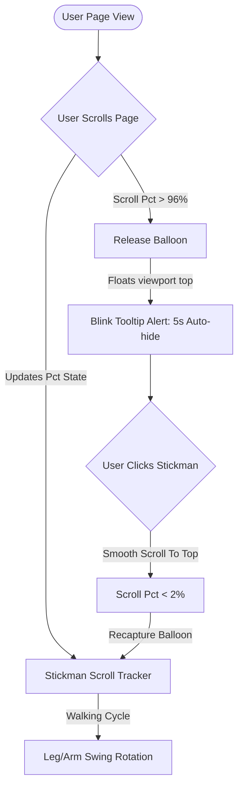

# Technical Architecture & Flow Document 🛠️

This portfolio represents a state-of-the-art Neobrutalist web experience. The project combines bold styling choices, interactive game-like mechanics, and high-performance modern architectures.

---

## 🎨 Creative & Intelligence Credits
* **Creative Director & Visionary:** **Harsh Mistry** *(whose creativity drove the unique scrollbar mechanics, neobrutalist styling, and interactive features).*
* **AI Collaborators:** Built with the assistance of **Claude Sonnet 4.6** and **Gemini 3.5 Flash** working in tandem to generate code, troubleshoot SSR runtime edge-cases, and optimize responsiveness.

---

## 🏗️ Technical Stack
* **Framework:** Next.js (App Router)
* **Language:** TypeScript (Type-safe compilation)
* **Styling System:** Vanilla CSS & Brutalist layout tokens with helper Utility classes.
* **Component Architecture:** React Client & Server Components
* **Asset Optimization:** Hand-tailored inline SVG vectors.

---

## 🕹️ Interactive Features & Architectural Flows

### 1. The Interactive Stickman Scrollbar
* **State Machine (`StickmanScrollbar.tsx`):**
  * Tracks global scroll percentage dynamically: `pct = scrollTop / (docHeight - viewportHeight)`.
  * Multiplies percentage against the viewport track bounds to align the stickman: `TRACK_PAD + scrollPct * (window.innerHeight - TRACK_PAD * 2 - stickmanHeight)`.
  * Avoids Next.js Server-Side Rendering (SSR) `"window is not defined"` errors using a client-side hydration mount guard (`mounted` state).
* **Limb Rotation & Walking Mechanics:**
  * Leg and arm swing states use custom time-dependent trigonometric offsets triggered during scroll events: `Math.sin(Date.now() / 80 + delay) * swingRange`.
  * Wiggles the stickman torso on active scroll movement and resets back to neutral when scroll actions stop.
* **Floating Balloon:**
  * The balloon is grouped inside the SVG paths.
  * When scroll position exceeds **96%**, `balloonReleased` becomes `true`, translating the balloon vector smoothly up to the top of the viewport (`top: 40px`).
  * A custom tooltip box (`🎈 CATCH MY BALLOON!`) appears next to the stickman, blinking for **5 seconds** before automatically fading out.
  * Clicking the stickman triggers a smooth scroll to the top (`window.scrollTo({ top: 0, behavior: 'smooth' })`). When scroll returns to `< 2%`, the balloon is recaptured into the stickman's hand.

### 2. Neobrutalist Grid & Responsive System
* **Mobile Card Stacking:** 
  * Tabular layouts (like volunteering, experience, and skills) swap automatically from side-by-side columns into modular, high-contrast neobrutalist cards on screens `< 768px`.
  * Resolved border collisions and horizontal overflow by switching absolute grid divider borders to dynamic border wrapping elements.
* **Full-Width Columns (`projects/page.tsx`):**
  * Adjusted grid structures for screen viewports down to `< 360px` using CSS grid auto-fit systems.

### 3. Non-Intrusive Terminal Context
* **Auto-Scroll Prevention:** 
  * Modified keyboard submission event in `Terminal.tsx` to stop page viewport shifts by targeting only the internal terminal logs output container: `terminalBody.scrollTop = terminalBody.scrollHeight` instead of `scrollIntoView()`.

### 4. Zero-Cost Serverless Mail Integration
* **Data Flow:**
  * When a user submits the contact form, React state validation locks the submit button into a `"SENDING..."` state.
  * A `POST` fetch request targets `https://api.web3forms.com/submit` sending a JSON payload.
  * This bypasses Next.js App Router dynamic paths entirely by writing form details directly to Web3Forms' API.
  * Delivers responses instantly to `hmistry864@gmail.com` for free with zero custom mail server configuration.

---
*Document maintained by Harsh Mistry. Built with creativity and AI efficiency.*
